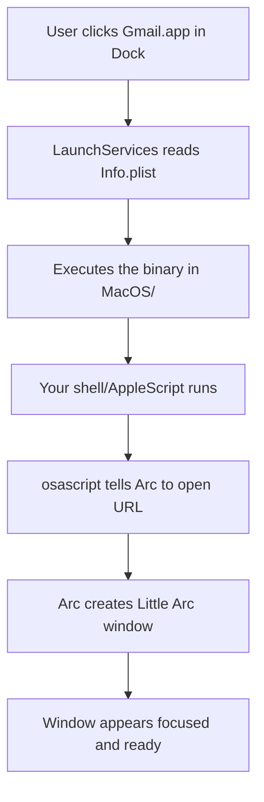

# Mental Model: Building macOS App Launchers for Arc Browser

> This document exists so you (and future you) actually understand what we're building instead of just following steps.

## Table of Contents

1. The Core Problem
2. What a macOS `.app` Actually Is
3. How Platypus Works
4. How Arc Handles External Launches
5. Little Arc vs Normal Windows vs `--app` Mode
6. The Architecture We Will Use
7. Filesystem Locations That Matter
8. Execution Flow (When You Click the Launcher)
9. Security & Permissions Model
10. Debugging & Inspection Tools
11. Tradeoffs & Honest Limitations
12. Alternative Approaches

---

## 1. The Core Problem

You want websites (Gmail, Linear, Notion, Figma, etc.) to feel like **real native macOS apps**:

- They live in the Dock
- They have their own icon
- They appear in `Cmd+Tab`
- They can be launched even when Arc is completely closed
- They feel focused and "app-like" rather than "just another browser tab"

### Why This Is Harder With Arc

Arc is an excellent browser, but it was not designed with PWA-style standalone apps in mind:

- Arc does **not** support the standard Chromium `--app` flag reliably
- Arc's custom UI (sidebar, Spaces, Boosts, Command Bar) interferes with classic app mode
- There is no built-in "Install as App" feature

This project exists to get as close as possible **while staying 100% inside your existing Arc installation**.

---

## 2. What a macOS `.app` Actually Is

This is the most important mental shift:

> **A `.app` is not a file. It is a directory with a very specific structure.**

When you see `Gmail.app` in `/Applications`, you are actually looking at a folder. Finder hides this by default.

### The Structure of a macOS App Bundle

```
MyApp.app/
├── Contents/
│   ├── Info.plist                 # The most important file
│   ├── MacOS/
│   │   └── MyApp                    # The actual executable
│   ├── Resources/
│   │   ├── MyApp.icns               # The icon
│   │   └── ... other resources
│   └── _CodeSignature/            # For signed apps
└── version.plist
```

### What Actually Happens When You Double-Click a .app

1. Finder calls into **LaunchServices**
2. LaunchServices reads `Contents/Info.plist`
3. It finds the `CFBundleExecutable` key
4. It executes the binary inside `MacOS/`
5. The app appears in the Dock and `Cmd+Tab`

This is why Platypus can turn a simple shell script into something that feels like a real application.

---

## 3. How Platypus Works

Platypus is a GUI tool that takes a script (Shell, AppleScript, Python, etc.) and wraps it in the proper `.app` bundle structure.

### What Platypus Actually Does

- Creates the `Contents/Info.plist` with correct keys
- Copies your script into the right place (usually `Contents/Resources/` or makes it the executable)
- Sets up the executable bit
- Optionally embeds an icon (`.icns`)
- Handles some code signing basics

The resulting `.app` is a **real** macOS application. It is not a shortcut.

### Why Platypus Over Automator or `appify`?

| Tool          | Strengths                              | Weaknesses                              | Best For                  |
|---------------|----------------------------------------|-----------------------------------------|---------------------------|
| **Platypus**  | Full control, great UI, reliable       | Requires separate install               | This project              |
| Automator     | Built-in, easy                         | Limited scripting power, ugly icons     | Simple one-offs           |
| `appify`      | Single bash script, no GUI             | Less polished, manual icon handling     | Quick prototypes          |
| Coherence X   | Best visual results (Chromium)         | Paid, uses its own browser engine       | When you can leave Arc    |

---

## 4. How Arc Handles External Launches

This is where most of the magic (and pain) lives.

### The Three Main Ways to Launch Something in Arc from Outside

**1. `open -a "Arc" "https://..."`**
- Simple and reliable
- Usually opens in a normal tab or Little Arc (depends on context)
- Arc decides the destination (Space, window, Little Arc)

**2. Direct binary execution**
```bash
/Applications/Arc.app/Contents/MacOS/Arc --app="https://..."
```
- This is what the classic `--app` flag looks like
- In Arc, results are often poor (Arc's UI fights it)

**3. AppleScript (Most Powerful)**
```applescript
tell application "Arc"
    make new tab with properties {URL:"https://example.com"}
    activate
end tell
```

**This third method is the key.**

`make new tab with properties {URL:...}` is the command that most reliably creates a **Little Arc** window — the closest thing Arc has to a focused, app-like experience.

---

## 5. Little Arc vs Normal Windows vs `--app` Mode

| Mode              | Visual Feel                     | Sidebar? | Feels Like a Real App? | Reliability | Recommended for Launchers? |
|-------------------|----------------------------------|----------|-------------------------|-------------|----------------------------|
| **Little Arc**    | Floating minimal window          | No       | Very good               | Excellent   | **Yes (best choice)**      |
| Normal Tab/Window | Full Arc interface               | Yes      | Poor                    | Excellent   | No                         |
| `--app` flag      | Inconsistent / broken            | Partial  | Sometimes               | Poor        | No (avoid)                 |

**Conclusion:** For Arc, the highest quality experience we can reliably deliver is a **dedicated Little Arc window** for each site.

---

## 6. The Architecture We Will Use

For each launcher we will create:

```
Gmail.app/
├── Contents/
│   ├── Info.plist
│   └── MacOS/
│       └── Gmail          (or a small wrapper)
└── Resources/
    └── script.sh      (or embedded AppleScript)
```

The script will do something like:

```bash
#!/bin/bash
osascript -e \
  'tell application "Arc" to make new tab with properties {URL:"https://mail.google.com"} activate'
```

This is simple, reliable, and works even when Arc is not running.

---

## 7. Filesystem Locations That Matter

### Arc Itself

- Executable: `/Applications/Arc.app/Contents/MacOS/Arc`
- User data: `~/Library/Application Support/Arc/`
- Preferences: `~/Library/Preferences/com.company.arc.plist` (or similar)

### Your Launchers

- Final location: `/Applications/YourApp.app`
- Icons live inside the bundle: `Contents/Resources/`
- You can also keep source `.icns` files in `~/Pictures/Icons/` or inside this repo

### Useful Hidden Locations

- `~/Library/Logs/` — sometimes contains crash or launch logs
- `~/Library/Preferences/` — where many apps store settings
- `/var/folders/` — temporary files (often where quarantine attributes live)

---

## 8. Execution Flow (When You Click the Launcher)



This flow is fast and reliable.

---

## 9. Security & Permissions Model

### Why Some Things Require Permissions

AppleScript uses **Apple Events**. Modern macOS is very restrictive about which apps can send Apple Events to other apps.

You may see a prompt like:

> "Terminal" wants to control "Arc"

This is normal the first time. You should allow it for the launcher to work reliably.

### Code Signing & Quarantine

When you download a `.app`, macOS may quarantine it. Right-click → Open the first time, or remove the quarantine attribute:

```bash
xattr -d com.apple.quarantine /Applications/YourApp.app
```

---

## 10. Debugging & Inspection Tools

### Essential Commands

**Inspect any .app bundle:**
```bash
open -R /Applications/YourApp.app          # Reveal in Finder
```

**Read the Info.plist:**
```bash
plutil -p /Applications/YourApp.app/Contents/Info.plist
```

**Check if an app is signed:**
```bash
codesign -dv --verbose=4 /Applications/YourApp.app 2>&1
```

**See what processes are running:**
```bash
ps aux | grep -i arc
```

**Watch what Arc does when launched:**
```bash
log stream --predicate 'process == "Arc"' --info
```

**Reset LaunchServices database (nuclear option):**
```bash
/System/Library/Frameworks/CoreServices.framework/Frameworks/LaunchServices.framework/Support/lsregister -kill -r -domain local -domain system -domain user
```

### Show Package Contents

In Finder, right-click any `.app` → **Show Package Contents**. This is how you explore the real structure.

---

## 11. Tradeoffs & Honest Limitations

| Approach                    | Quality of "App" Feel | Uses Your Arc Data | Maintenance | Cost    | Recommendation                     |
|-----------------------------|--------------------------|--------------------|-------------|---------|------------------------------------|
| Platypus + Little Arc (this) | Good                     | Yes                | Low         | Free    | Best choice if you must stay in Arc |
| Safari "Add to Dock"       | Excellent                | No                 | Very Low    | Free    | Often the best overall experience   |
| Coherence X                  | Outstanding              | No                 | Low         | Paid    | Best if you can use Chromium engine |
| Chrome/Brave PWA             | Very Good                | No                 | Low         | Free    | Great if you're okay leaving Arc    |
| Automator                    | Poor                     | Yes                | Low         | Free    | Only for quick experiments          |

**Bottom line:** If staying inside Arc is a hard requirement, Platypus + Little Arc is one of the best available approaches in 2026.

---

## 12. Alternative Approaches (For Context)

- **Safari Add to Dock** — Surprisingly excellent in modern macOS
- **Coherence X** — The gold standard for Chromium-based site apps
- **Unite** or **Fluid** — Older WebKit-based solutions
- **Raycast / Alfred** scripts — Great for keyboard-driven workflows
- **Shortcuts.app** — Native, but limited UI customization

---

## Final Mental Model

We are not creating "real" PWAs.
We are creating **excellent macOS application wrappers** that speak to Arc via AppleScript and reliably produce focused Little Arc windows.

When done well, the experience is good enough that many people never feel the difference for daily tools.

The value of this project is not just the `.app` files — it is the deep understanding of how macOS, browsers, and scripting actually interoperate.

---

*Document version: 0.1 — May 2026*
*We'll continue refining this as we build.*
